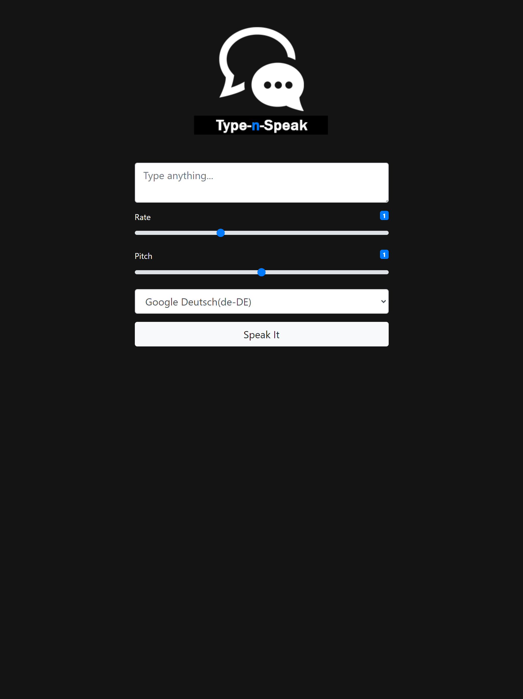

# Vanilla JS - Text-to-Speech App

### Live Demo:
https://sp33ch.netlify.app/

### About:
Utilizing the Web Speech API, this app will convert any inputted text to an audible voice.  The user can select the type of voice they'd like their text read in, and the user can adjust the pitch and rate of speed of the voice.

### Acknowledgements:

Thanks again to Traversy Media for the awesome tutorial.  If I ever get a job it will be thanks to this guy!

